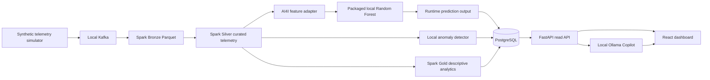

# Industrial Fleet Intelligence Platform

Project Status: In Development

Industrial Fleet Intelligence Platform is an independent local-first portfolio project that demonstrates an end-to-end industrial Data and AI system using fictional fleet assets, deterministic synthetic telemetry, the public synthetic AI4I predictive-maintenance dataset, local data pipelines, a read-only FastAPI backend, a React dashboard, and a local Ollama-backed AI Copilot. It is not affiliated with, endorsed by, or built from proprietary data from any manufacturer or industrial company.

## What It Demonstrates

- Local Windows development with Docker Desktop, WSL2, Python 3.12, Java 17, Node.js 24, and Docker Compose.
- Synthetic telemetry generation, Kafka transport, Spark Bronze/Silver/Gold processing, and PostgreSQL operational persistence.
- Leakage-aware predictive-maintenance modeling with scikit-learn, XGBoost comparison, SHAP explainability, and MLflow tracking.
- Operational intelligence APIs and dashboard views for fleet state, machine state, predictions, anomalies, alerts, drift, and explanations.
- A read-only local AI Copilot that uses Ollama and validated tools over materialized platform state.

## System Architecture



## Key Capabilities

- **Data pipeline:** deterministic local telemetry can flow through Kafka into Spark-managed Bronze, Silver, and Gold datasets.
- **ML methodology:** the AI4I model excludes identifier and target-adjacent leakage fields, freezes the model and threshold before final holdout evaluation, and packages the final model locally.
- **Final model report:** `reports/ai4i/final_test_metrics.json` records a `RandomForestClassifier` with frozen threshold `0.14`, test ROC AUC `0.968707`, test average precision `0.770679`, recall `0.843137`, precision `0.462366`, and F2 `0.723906` at the frozen threshold.
- **Explainability:** SHAP values are stored as model attributions for persisted predictions; they are not presented as causal physical root causes.
- **Monitoring:** drift uses PSI and range diagnostics for model and anomaly input distributions; drift is not treated as model accuracy.
- **Dashboard:** React + TypeScript + Vite dashboard with route-level code splitting, typed API calls, charts, machine detail views, alerts, drift, and Copilot.
- **AI Copilot:** local Ollama only, source-grounded, read-only, and constrained to validated tools. It does not execute arbitrary SQL or mutate platform state.

## Technology Stack

| Area | Technology |
| --- | --- |
| Backend | FastAPI, psycopg |
| Frontend | React, TypeScript, Vite, TanStack Query, Recharts |
| Database | PostgreSQL through Docker Compose |
| Streaming | Apache Kafka through Docker Compose |
| Processing | Apache Spark in Docker |
| ML | scikit-learn, XGBoost comparison, joblib |
| Explainability | SHAP |
| MLOps | MLflow local tracking |
| GenAI | Ollama local model only |
| Testing and quality | pytest, unittest helpers, Ruff, Vitest, oxlint, GitHub Actions |

## Quick Start

Minimal validation uses the project virtual environment and frontend workspace only:

```powershell
.\.venv\Scripts\python.exe --version
.\.venv\Scripts\python.exe scripts/check_project.py
```

Core dashboard mode requires PostgreSQL materialized state and frontend dependencies:

```powershell
docker compose up -d postgres
.\.venv\Scripts\python.exe scripts/apply_migrations.py
.\.venv\Scripts\python.exe scripts/seed_database.py
.\.venv\Scripts\python.exe -m fastapi dev apps/api/main.py --host 127.0.0.1 --port 8000
cd apps\web
npm run dev
```

On Windows, the convenience launcher can start PostgreSQL, the API, and the dashboard:

```powershell
.\scripts\start_local_platform.ps1
```

The full local pipeline is documented in [docs/pipeline.md](docs/pipeline.md). It includes Kafka, Spark, model-input adaptation, local inference, anomaly detection, drift, alert materialization, and optional Copilot validation.

## Demo Flow

Use [docs/demo.md](docs/demo.md) for a 5-10 minute recruiter walkthrough. Suggested screenshots are listed in [docs/screenshots/README.md](docs/screenshots/README.md); no generated screenshots are committed.

## Validation

Run the Python suite:

```powershell
.\.venv\Scripts\python.exe -m pytest
```

Run Python quality checks:

```powershell
.\.venv\Scripts\python.exe -m ruff check --no-cache .
.\.venv\Scripts\python.exe -m ruff format --check --no-cache .
```

Run frontend checks from `apps/web`:

```powershell
npm run test
npm run lint
npm run build
```

Run service-dependent checks only when local services are available:

```powershell
.\.venv\Scripts\python.exe scripts/check_project.py --integration
.\.venv\Scripts\python.exe scripts/check_project.py --copilot
```

## Repository Structure

- `apps/api`: FastAPI read API and PostgreSQL repository layer.
- `apps/web`: React dashboard.
- `services`: simulator, streaming, database, and Copilot support modules.
- `pipelines`: Spark batch and streaming pipeline code.
- `ml`: modeling, inference, anomaly detection, explainability, and ignored local artifacts.
- `data`: ignored local runtime data layers and sample tracked fixtures.
- `db`: PostgreSQL migrations.
- `docs`: architecture, setup, pipeline, and demo documentation.
- `reports`: tracked static validation and model-development reports.
- `scripts`: local automation and validation scripts.
- `tests`: Python test suite.

## Engineering Decisions

- The project remains local-first and reproducible with zero paid services.
- Runtime data, generated model artifacts, local MLflow stores, caches, secrets, and Docker volumes are ignored by Git.
- PostgreSQL stores materialized operational state, not raw high-volume telemetry history.
- API requests do not run Spark, Kafka consumers, model training, model inference, SHAP generation, anomaly scoring, or drift calculation.
- AI4I predictions are model estimates, anomaly scores are detector scores, drift is an input-distribution diagnostic, and SHAP values are model attributions.

## Limitations

- All operational machines and telemetry are fictional or synthetic.
- The dashboard has no authentication or write workflows.
- Dockerized API/frontend services are intentionally not implemented.
- Databricks integration and cloud deployment are outside the current scope.
- The final model artifact is ignored and must be regenerated locally from documented scripts.

## License And Data Attribution

This repository is an independent educational portfolio project. The AI4I 2020 Predictive Maintenance Dataset is a public synthetic dataset from the UCI Machine Learning Repository. Project-generated telemetry and fleet records are fictional and must not be represented as real industrial data.
